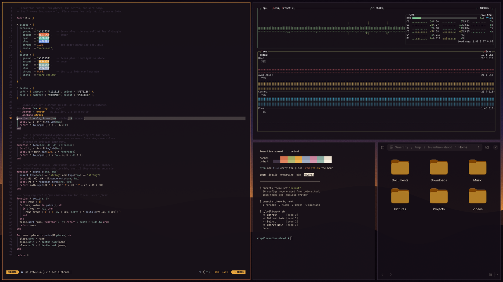

# Beirut

The city after dark. Warm lamplight on stone.

One of four themes in **Levantine Sunset** — two places, each at two depths.
Clay and amber on a plum-leaning indigo base.



## Install

```sh
omarchy theme install https://github.com/gaius-codius/omarchy-beirut-theme
```

Then pick it from the theme menu, or `omarchy theme set "Beirut"`.

## Palette

| key | |
|---|---|
| `accent` | `#E8A63F` |
| `background` | `#171118` |
| `foreground` | `#F0E5D3` |
| `red` | `#D9744E` |
| `yellow` | `#E8A63F` |
| `green` | `#A3AF62` |
| `cyan` | `#88ADA2` |
| `blue` | `#92A0B9` |
| `magenta` | `#CD87A2` |

The full set is in [`colors.toml`](colors.toml). Depth moves luminance only and
place moves hue only, so the two axes stay independent: both depths of a place
share every accent, and both places at a depth share the same luminance on every key.

## Wallpapers

| file | |
|---|---|
| `1-colonnade` | pointed arches cut from a dark wall, evening beyond |
| `2-ridge` | two rolling silhouettes against a horizon |
| `3-shaft` | one warm beam falling through the dark |
| `4-scanline` | a horizon on a CRT, every third row dimmed |

All four are generated procedurally from this theme's own hex values — there are no
source photographs. Cycle them with `omarchy theme bg next`, or drop your own into
`~/.config/omarchy/backgrounds/beirut/`.

`unlock.png` is the **Plymouth boot logo**, not a lock screen: a pointed arcade with
a quiet lowercase `omarchy` beneath it. The same arcade is the subject of
`1-colonnade`.

## The rest of the collection

[Batroun](https://github.com/gaius-codius/omarchy-batroun-theme) · [Batroun Noir](https://github.com/gaius-codius/omarchy-batroun-noir-theme) · [Beirut Noir](https://github.com/gaius-codius/omarchy-beirut-noir-theme)

All four, plus the generator that builds them:
[levantine-sunset](https://github.com/gaius-codius/levantine-sunset)

## Optional: matching file-manager colours

`omarchy theme set` does touch GTK — `omarchy-theme-set-gnome` sets `color-scheme`,
`gtk-theme` and `icon-theme` on every switch — but `gtk-theme` is only ever
`Adwaita` or `Adwaita-dark`, so a theme's *colours* never reach GTK and every dark
theme yields an identical Nautilus. This theme ships an `icons.theme` so at least
the folder icons match its accent, which is the documented mechanism and travels
with the theme.

Carrying the actual colours needs a machine-level template, because there is no
sanctioned way to ship one inside a theme. It applies to **every** installed theme,
stock ones included — which is why it isn't in this repo:

    ~/.config/omarchy/themed/gtk.css.tpl        # the template
    ~/.config/gtk-4.0/gtk.css -> ~/.local/state/omarchy/current/theme/gtk.css

`omarchy-theme-set-templates` globs `~/.config/omarchy/themed/*.tpl`, so adding a
template makes every theme generate a `gtk.css` alongside its `ghostty.conf`; the
symlink points GTK at whichever theme is active. GTK reads its CSS at startup, so
restart an app to see a change (`nautilus -q`, then reopen). The template is in the
[collection repo](https://github.com/gaius-codius/levantine-sunset).

## What's in here

Colour and images only — nothing that runs code, so nothing is stripped on install.
Omarchy regenerates the twenty app configs from `colors.toml` on your machine.

## Licence

MIT. See [LICENSE](LICENSE).
